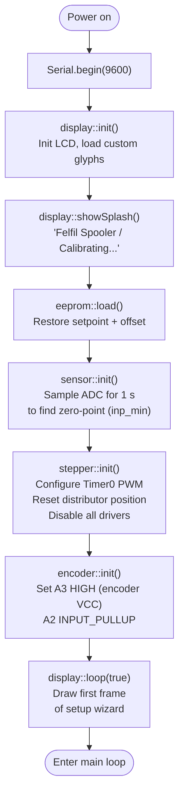
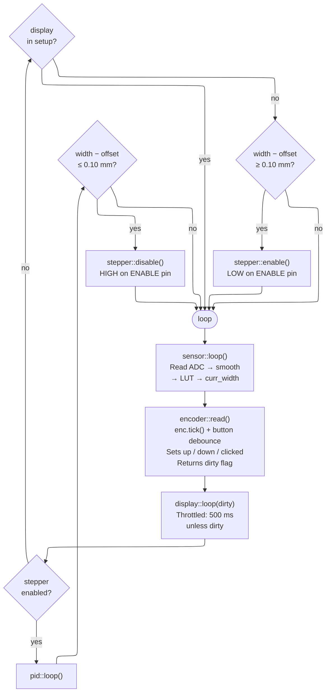
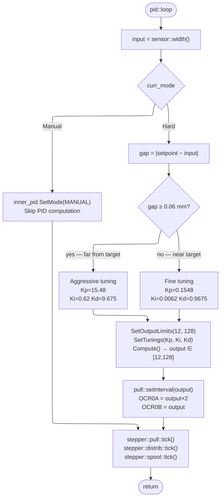
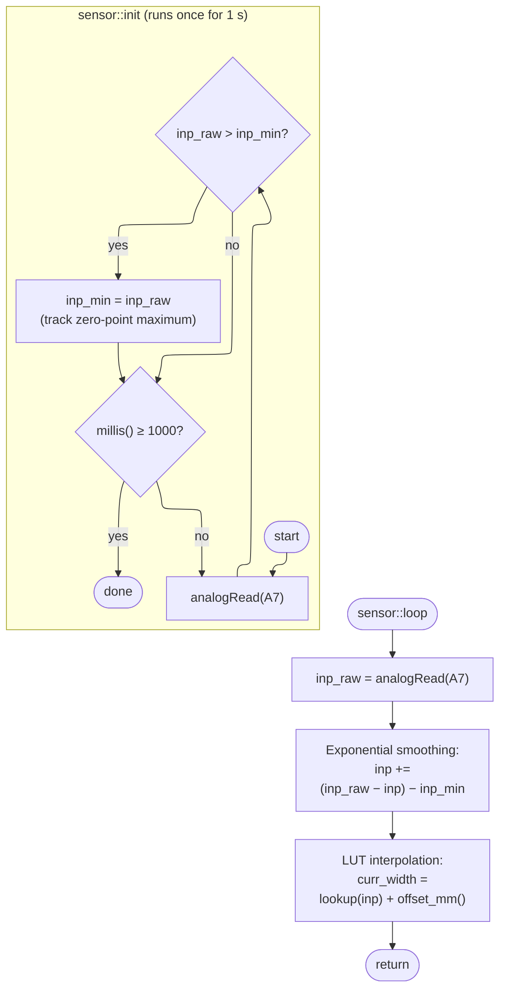

# Control Flow

## Startup Sequence

```mermaid
%%{init: {'layout': 'elk'}}%%
flowchart TD
    BOOT([Power on]) --> SERIAL["Serial.begin(9600)"]
    SERIAL --> DISP_INIT["display::init()<br>Init LCD, load custom glyphs"]
    DISP_INIT --> SPLASH["display::showSplash()<br>'Felfil Spooler / Calibrating...'"]
    SPLASH --> EEPROM["eeprom::load()<br>Restore setpoint + offset"]
    EEPROM --> SENSOR_INIT["sensor::init()<br>Sample ADC for 1 s<br>to find zero-point (inp_min)"]
    SENSOR_INIT --> STEP_INIT["stepper::init()<br>Configure Timer0 PWM<br>Reset distributor position<br>Disable all drivers"]
    STEP_INIT --> ENC_INIT["encoder::init()<br>Set A3 HIGH (encoder VCC)<br>A2 INPUT_PULLUP"]
    ENC_INIT --> DISP_LOOP["display::loop(true)<br>Draw first frame<br>of setup wizard"]
    DISP_LOOP --> LOOP([Enter main loop])
```

## Main Loop

```mermaid
%%{init: {'layout': 'elk'}}%%
flowchart TD
    START([loop]) --> SENSOR["sensor::loop()<br>Read ADC → smooth<br>→ LUT → curr_width"]
    SENSOR --> ENC["encoder::read()<br>enc.tick() + button debounce<br>Sets up / down / clicked<br>Returns dirty flag"]
    ENC --> DISP["display::loop(dirty)<br>Throttled: 500 ms<br>unless dirty"]

    DISP --> EN_CHECK{"stepper<br>enabled?"}

    EN_CHECK -->|yes| PID_LOOP["pid::loop()"]
    PID_LOOP --> WIDTH_CHECK{"width − offset<br>≤ 0.10 mm?"}
    WIDTH_CHECK -->|yes| DISABLE["stepper::disable()<br>HIGH on ENABLE pin"]
    WIDTH_CHECK -->|no| START

    EN_CHECK -->|no| SETUP_CHECK{"display<br>in setup?"}
    SETUP_CHECK -->|yes| START
    SETUP_CHECK -->|no| WIDTH_CHECK2{"width − offset<br>≥ 0.10 mm?"}
    WIDTH_CHECK2 -->|yes| ENABLE["stepper::enable()<br>LOW on ENABLE pin"]
    WIDTH_CHECK2 -->|no| START

    DISABLE --> START
    ENABLE --> START
```

## PID Loop (`pid::loop`)

```mermaid
%%{init: {'layout': 'elk'}}%%
flowchart TD
    START([pid::loop]) --> INPUT["input = sensor::width()"]
    INPUT --> MODE{curr_mode}

    MODE -->|Manual| MANUAL["inner_pid.SetMode(MANUAL)<br>Skip PID computation"]
    MANUAL --> TICK

    MODE -->|Hard| GAP["gap = |setpoint − input|"]
    GAP --> GAIN_CHECK{"gap ≥ 0.06 mm?"}

    GAIN_CHECK -->|"yes — far from target"| AGGRESSIVE["Aggressive tuning<br>Kp=15.48<br>Ki=0.62  Kd=9.675"]
    GAIN_CHECK -->|"no — near target"| FINE["Fine tuning<br>Kp=0.1548<br>Ki=0.0062  Kd=0.9675"]

    AGGRESSIVE --> COMPUTE
    FINE --> COMPUTE

    COMPUTE["SetOutputLimits(12, 128)<br>SetTunings(Kp, Ki, Kd)<br>Compute() → output ∈ [12,128]"] --> SET_INT["pull::setInterval(output)<br>OCR0A = output×2<br>OCR0B = output"]

    SET_INT --> TICK["stepper::pull::tick()<br>stepper::distrib::tick()<br>stepper::spool::tick()"]
    TICK --> END([return])
```

## Sensor Reading (`sensor::loop`)

```mermaid
%%{init: {'layout': 'elk'}}%%
flowchart TD
    START([sensor::loop]) --> READ["inp_raw = analogRead(A7)"]
    READ --> SMOOTH["Exponential smoothing:<br>inp +=<br>(inp_raw − inp) − inp_min"]
    SMOOTH --> LUT["LUT interpolation:<br>curr_width =<br>lookup(inp) + offset_mm()"]
    LUT --> END([return])

    subgraph init["sensor::init (runs once for 1 s)"]
        BOOT2([start]) --> SAMPLE["analogRead(A7)"]
        SAMPLE --> MAX_CHECK{"inp_raw > inp_min?"}
        MAX_CHECK -->|yes| UPDATE["inp_min = inp_raw<br>(track zero-point maximum)"]
        MAX_CHECK -->|no| TIME_CHECK
        UPDATE --> TIME_CHECK{"millis() ≥ 1000?"}
        TIME_CHECK -->|no| SAMPLE
        TIME_CHECK -->|yes| DONE([done])
    end
```
