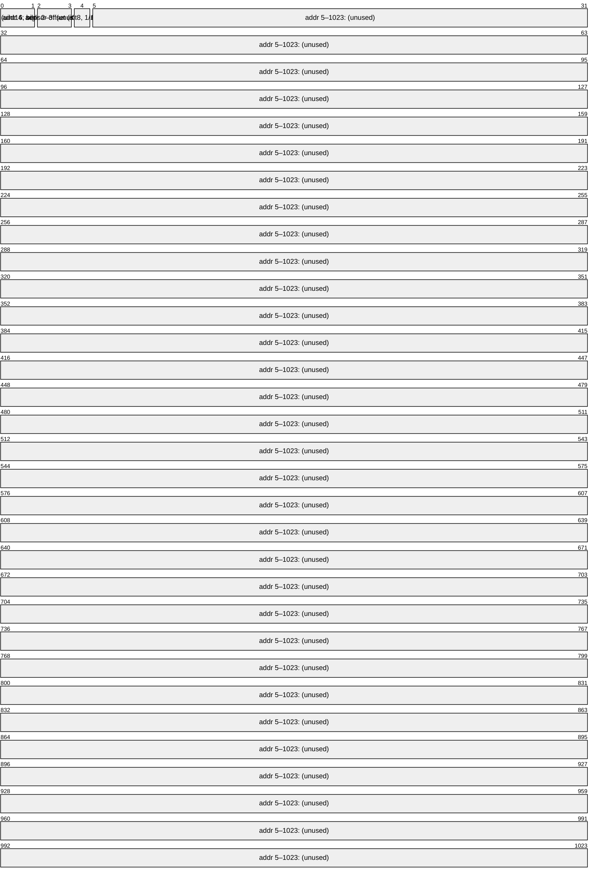

# EEPROM Layout

The ATmega328P has 1024 bytes of EEPROM. This project uses 5 bytes.

## Field Definitions

| Address | Size | Type | Field | Range | Notes |
|---|---|---|---|---|---|
| 0 | 1 byte | `uint8` | Setpoint high byte | — | `highByte(setpoint_int)` |
| 1 | 1 byte | `uint8` | Setpoint low byte | — | `lowByte(setpoint_int)` |
| 2–3 | 2 bytes | — | Unused | — | |
| 4 | 1 byte | `uint8` | Sensor offset | 0–255 raw\n(used as signed ±25) | Written as `sensor::offset()` |

## Behaviour

- **Load** (`eeprom::load`): called once in `setup()`. If the stored setpoint reads as < 1 (fresh chip), it is initialised to 175 (1.75 mm).
- **Update** (`eeprom::update`): called whenever `sensor::setOffset()` is invoked (i.e. any time the user adjusts the offset in the running menu). Uses `EEPROM.update()` to avoid unnecessary write cycles.
- The PID setpoint is stored but note that `eeprom::update()` is only triggered via `sensor::setOffset()` — changes to setpoint made in the setup wizard are not explicitly flushed unless the offset is also changed. This may be a latent bug.
