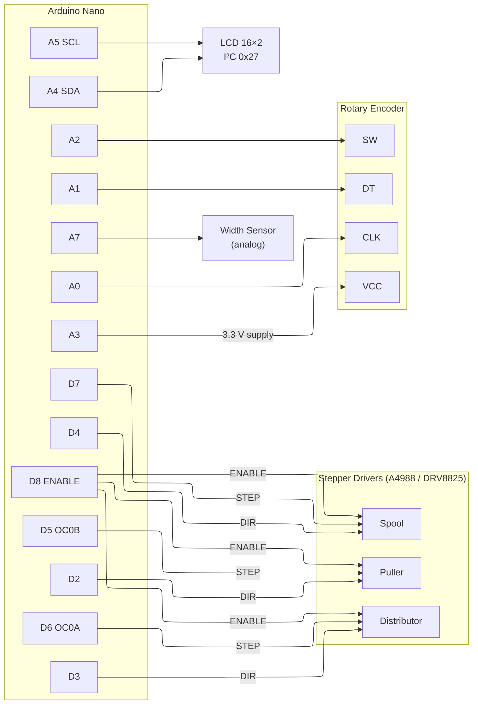
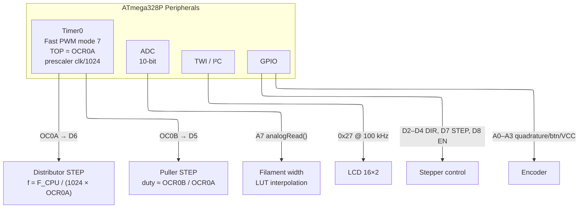

# Hardware

## Pin Assignments

| Pin | Direction | Connected to | Notes |
|---|---|---|---|
| D2 | OUT | Puller DIR | |
| D3 | OUT | Distributor DIR | |
| D4 | OUT | Spool DIR | |
| D5 | OUT | Puller STEP | Timer0 OC0B hardware PWM |
| D6 | OUT | Distributor STEP | Timer0 OC0A hardware PWM |
| D7 | OUT | Spool STEP | Software-timed via `millis()` |
| D8 | OUT | Stepper ENABLE | Active LOW; shared across all three drivers |
| A0 | IN | Encoder CLK | RotaryEncoder pin 2 |
| A1 | IN | Encoder DT | RotaryEncoder pin 1 |
| A2 | IN | Encoder SW | Button, INPUT_PULLUP; click on release |
| A3 | OUT | Encoder VCC | Driven HIGH to power the encoder module |
| A4 | I²C SDA | LCD | LiquidCrystal_I2C |
| A5 | I²C SCL | LCD | LiquidCrystal_I2C |
| A7 | IN (ADC) | Width sensor | Analog; 10-bit ADC, mapped via LUT |

## Connection Diagram

## MCU Peripheral Usage

### Timer0 Detail

Timer0 is reconfigured away from Arduino's default `millis()` PWM use to produce hardware step pulses for the puller and distributor motors:

- **Mode**: Fast PWM, TOP = OCR0A (mode 7: WGM02:0 = 111)
- **OC0A** (D6, Distributor STEP): toggles at TOP → 50 % square wave
- **OC0B** (D5, Puller STEP): clears at OCR0B, sets at BOTTOM → duty ≈ 50 % when `OCR0B = OCR0A/2`
- **Frequency formula**: `f = F_CPU / (prescaler × (OCR0A + 1))`
- `setInterval(n)` sets `OCR0A = 2n`, `OCR0B = n`

The spool motor (`D7`) is driven by software timing using `millis()` in `stepper::spool::tick()`.
