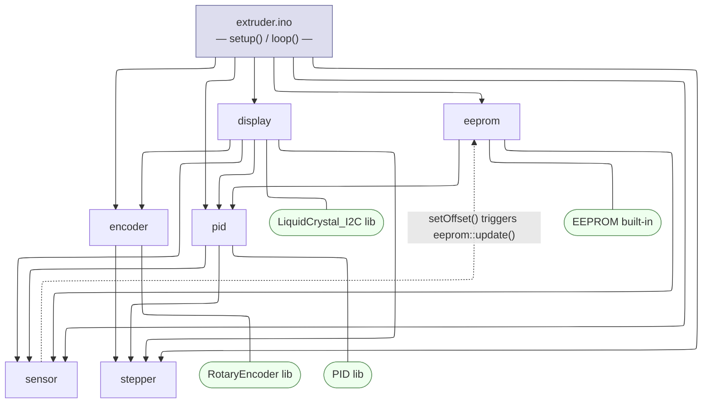

# Module Architecture

## Dependency Graph

## Module Responsibilities

| Module | Namespace | Responsibility |
|---|---|---|
| `extruder.ino` | — | Top-level setup/loop; stepper enable/disable logic |
| `stepper.ino` | `stepper::` | GPIO and Timer0 PWM for three stepper motors |
| `sensor.ino` | `sensor::` | ADC read, exponential smoothing, LUT interpolation for filament width |
| `pid.ino` | `pid::` | Dual-gain PID loop; maps output to puller step interval |
| `encoder.ino` | `encoder::` | Polls RotaryEncoder, debounces button, exposes `up`/`down`/`clicked` |
| `display.ino` | `display::` | LCD state machine — setup wizard and running menu |
| `eeprom.ino` | `eeprom::` | Persists PID setpoint and sensor offset across power cycles |

## Notes

- `sensor` and `eeprom` have a runtime cycle: `sensor::setOffset()` immediately calls `eeprom::update()` to persist the change. The header-level include graph is acyclic (sensor.h does not include eeprom.h).
- `encoder.h` includes `stepper.h` solely to inherit the `clamp()` macro defined there.
