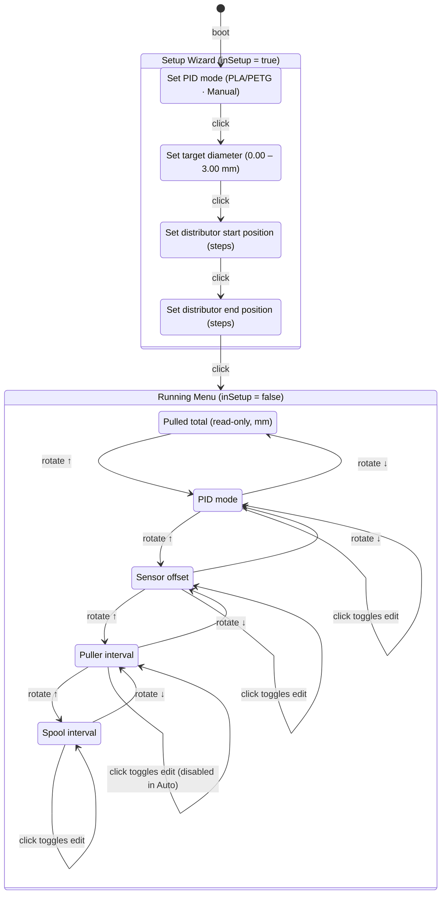

# UI State Machine

The display is driven by `display::loop()` and uses a 16×2 I²C LCD. There are two top-level phases: a linear **setup wizard** on first boot, followed by the **running menu**.

## State Diagram

## Setup Wizard Screens

| Screen | Encoder action | Range / effect |
|---|---|---|
| `SetupMode` | rotate | Cycle through `PLA/PETG`, `Manual` |
| `SetupDiam` | rotate | Target diameter 0.00 – 3.00 mm (0.10 mm/click) |
| `SetupSpoolStart` | rotate | Distributor start position in steps; immediately moves motor |
| `SetupSpoolEnd` | rotate | Distributor end position in steps; immediately moves motor |

Click advances through each screen in sequence. Setup wizard runs every boot.

## Running Menu Screens

| Screen | Prefix (browse) | Prefix (edit) | Adjustable by encoder | Saved to EEPROM |
|---|---|---|---|---|
| `Stats` | `Pulled:` | — | No (read-only) | No |
| `Mode` | ` Mode:` | `>Mode:` | PID mode | Yes (via setpoint save) |
| `WidthOffset` | ` Offset:` | `>Offset:` | ±25 (0.01 mm steps) | Yes |
| `PullSpeed` | ` PullInt:` | `>PullInt:` | Interval 12–128 ms | No |
| `SpoolSpeed` | ` SplInt:` | `>SplInt:` | Interval 10–1000 ms | No |

Row 0 always shows a live status bar: current diameter and pull speed while running, or `Spooler ready!` when stopped.

## Display Refresh

`display::loop()` is called every main loop iteration but only redraws if either:
- the `dirty` flag is set (encoder input received), or
- 500 ms have elapsed since the last redraw (`display::interval`).
